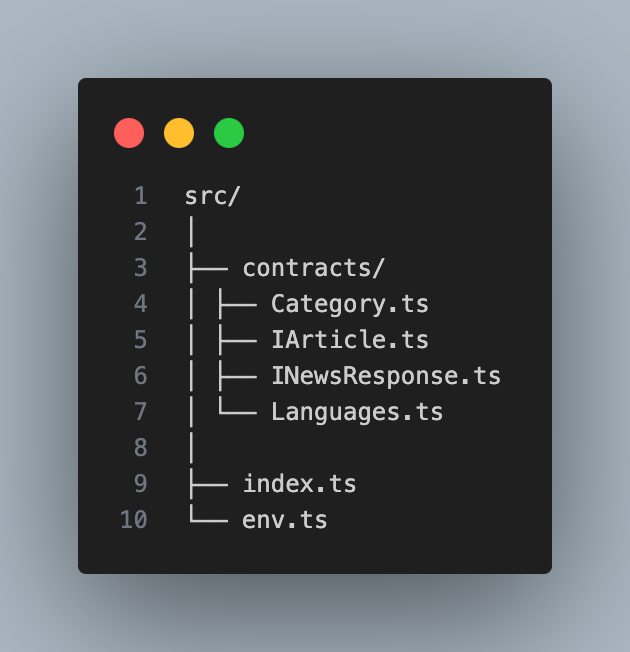

# News App

## Description

This project is a simple web application that allows users to search for news articles based on various filters and categories. The app fetches news articles from the News API and displays them dynamically on the web page. Users can filter articles by keywords, language, popularity, and category.

## Features

- Search for news articles using keywords.
- Filter news articles by language and popularity.
- Display top headlines by category.
- Error handling for API requests and displaying appropriate messages.

## Technologies Used

- TypeScript
- HTML
- CSS
- News API ([newsapi.org](https://newsapi.org/))

## Demo

Unfortunately, CORS is enabled only for localhost in the free version!
You can view a live demo of the project [here](https://christianscholtysik.github.io/NewsAPI/).

## Screenshots

## Setup and Installation

1. Clone the repository:

   - git clone https://github.com/your-username/news-app.git
   - cd news-app

2. Install dependencies:

   - npm install

3. Add your News API key:

- Create a file named env.ts in the root directory.
- Add your News API key in the following format:
  export const API_KEY = "your_news_api_key";

4. Run the application:

- npm start

## File Structure

## Usage

1. Search for Articles

   - Enter a keyword in the search input field.
   - Select a language from the language dropdown.
   - Select a popularity filter from the filter dropdown.
   - Click the "Search" button to fetch and display - articles based on the provided filters.

2. Filter by Category
   - Click on any category button to fetch and display top headlines for that category.

## Contact

Created by Pius (https://github.com/noctwo) & Christian (https://github.com/ChristianScholtysik)
